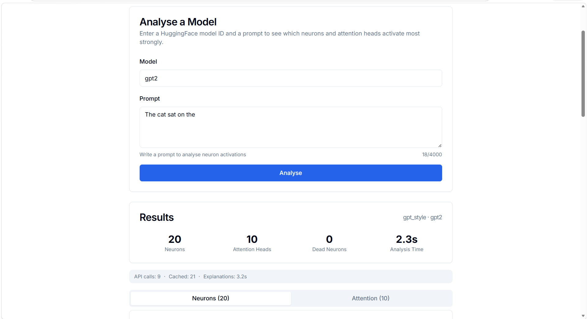
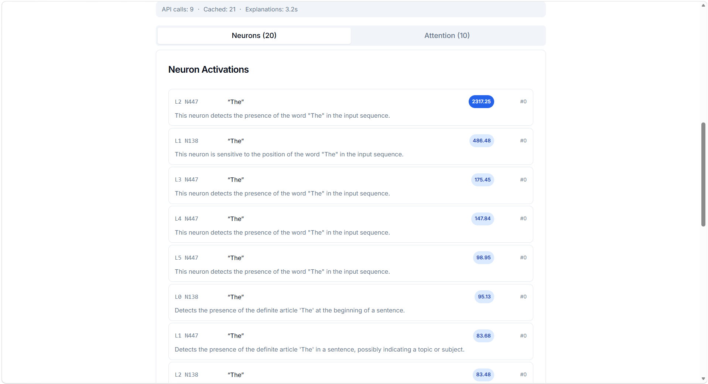
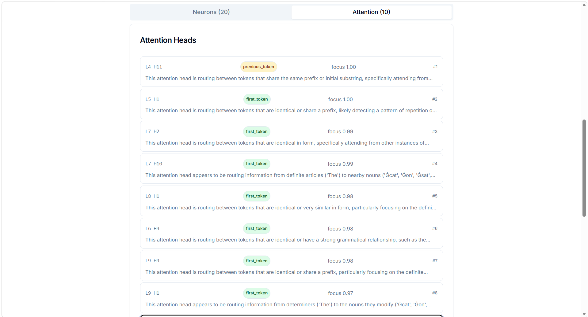
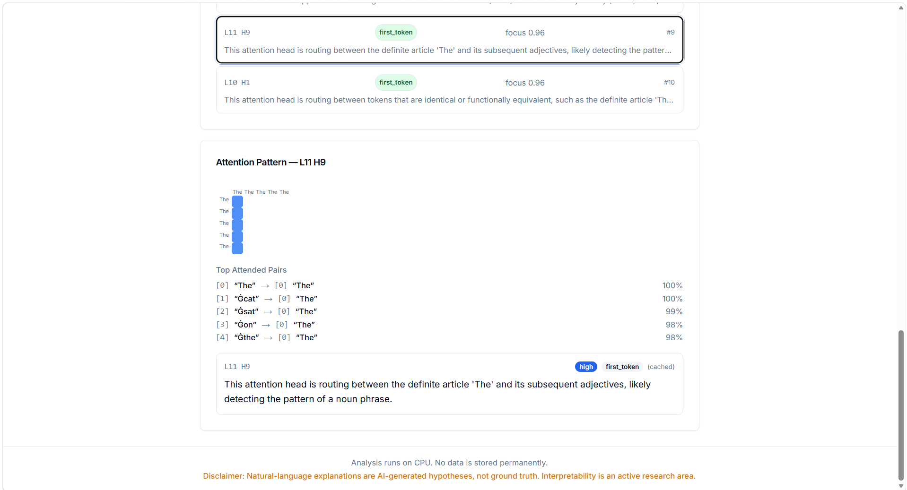
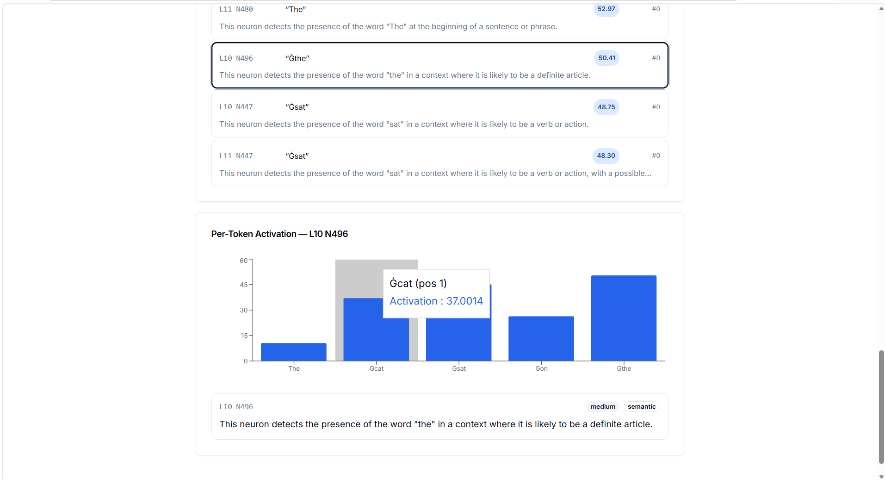

# Explain This Model

Interpretability-as-a-service for HuggingFace transformer models. Upload any model + prompt and get ranked neuron/attention head activations with natural-language explanations powered by **Groq, Gemini, or Claude** — use whichever API you prefer.

---

## Screenshots


**Home page** — enter a model and prompt


**Analysis result** — ranked neurons with explanations


**Neuron activations** — per-token activation heatmap, statistics, contexts


**Attention heads** — ranked heads with focus scores and pattern types


**Attention pattern** — head-level attention matrix heatmap


**Per-token activation** — activation strength across tokens

---

## Quick Start

```bash
# Clone and set up
cp .env.example .env

# Pick an API provider, add your key to .env, and set EXPLANATION_PROVIDER:
#   Groq   (free, no card): GROQ_API_KEY=gsk_...    → EXPLANATION_PROVIDER=groq
#   Gemini (free tier):     GOOGLE_API_KEY=AIza...   → EXPLANATION_PROVIDER=gemini
#   Claude (paid):          ANTHROPIC_API_KEY=sk-ant-... → EXPLANATION_PROVIDER=claude

# Start everything
docker compose up --build
```

| Service | URL |
|---------|-----|
| Frontend | http://localhost:3000 |
| Backend | http://localhost:8000 |
| API docs | http://localhost:8000/docs |

> **No API key?** The analysis pipeline still runs — you get neuron/head rankings and statistics, just no explanations. Add a key later and re-run.

---

## Architecture

```
┌──────────┐     ┌──────────────────────┐     ┌──────────────────────┐
│ Frontend │────▶│   FastAPI Backend    │────▶│   Celery Worker     │
│ Next.js  │◀────│   port 8000          │◀────│   (analysis task)   │
│ port 3000│     │                      │     │                      │
└──────────┘     │  ┌─────────────────┐ │     └──────┬───────────────┘
                 │  │    Redis        │◀──────────────┘
                 │  │  (cache/broker) │ │             │
                 │  └─────────────────┘ │             │
                 │  ┌─────────────────┐ │             │
                 │  │    SQLite       │ │◄────────────┘
                 │  │  (persistence)  │ │
                 │  └─────────────────┘ │
                 └──────────────────────┘
```

**Flow:** Client submits a model + prompt → FastAPI creates a job record → Celery worker picks it up → loads model, runs forward pass, analyses activations, generates explanations → stores result → frontend polls and displays.

---

## API Endpoints

| Method | Path | Description |
|--------|------|-------------|
| POST | `/api/analyze` | Submit model + prompt for analysis |
| GET | `/api/jobs/{id}` | Poll job status |
| GET | `/api/results/{id}` | Retrieve completed results |
| GET | `/api/jobs/{id}/neuron/{layer}/{neuron}` | Single neuron detail |
| GET | `/api/jobs/{id}/head/{layer}/{head}` | Single attention head detail |
| GET | `/api/models/search` | Search HuggingFace models |
| GET | `/api/models/validate` | Validate model compatibility |
| DELETE | `/api/jobs/{id}` | Delete a job |
| GET | `/api/config` | Current configuration |
| GET | `/api/health` | Health check |

---

## Configuration

All settings in `configs/default.yaml`:

| Key | Default | Description |
|-----|---------|-------------|
| `analysis.top_k_neurons` | `20` | Number of top neurons to rank |
| `analysis.top_k_heads` | `10` | Number of top attention heads to rank |
| `analysis.max_prompt_tokens` | `512` | Maximum prompt length in tokens |
| `explanation.provider` | `groq` | API provider: `groq`, `gemini`, or `claude` |
| `explanation.groq_model` | `llama-3.1-8b-instant` | Model for Groq |
| `explanation.gemini_model` | `gemini-2.0-flash` | Model for Gemini |
| `explanation.claude_model` | `claude-3-haiku-20240307` | Model for Claude |
| `explanation.batch_size` | `5` | Neurons per API call |
| `rate_limiting.max_jobs_per_hour` | `10` | Max analysis jobs per hour |
| `cache.activation_ttl_seconds` | `3600` | Activation cache TTL |
| `cache.explanation_ttl_seconds` | `86400` | Explanation cache TTL (24h) |
| `model.max_size_mb` | `1024` | Maximum model size |

---

## Provider Comparison

| Provider | Sign Up | Env Var | Value | Free Tier |
|----------|---------|---------|-------|-----------|
| **Groq** | [console.groq.com](https://console.groq.com) | `GROQ_API_KEY` | `groq` | 30 req/min, no credit card |
| **Gemini** | [aistudio.google.com](https://aistudio.google.com/apikey) | `GOOGLE_API_KEY` | `gemini` | 60 req/min, free |
| **Claude** | [console.anthropic.com](https://console.anthropic.com) | `ANTHROPIC_API_KEY` | `claude` | Paid (usage-based) |

---

## Features

- **Model-agnostic** — No hardcoded layer names. Works with GPT-2, BERT, LLaMA, T5, DistilBERT, and any HuggingFace model up to 1GB.
- **Neuron analysis** — Per-neuron statistics: mean activation, variance, top-K contexts, dead neuron detection.
- **Attention analysis** — Pattern classification (vertical, diagonal, block), focus score, induction head detection.
- **Natural-language explanations** — Batch-generated via Groq (default), Gemini, or Claude.
- **Job queue** — Celery + Redis for reliable async processing with progress reporting.
- **Caching** — Redis-backed explanation cache (auto-falls back to in-memory), disk-backed activation cache with LRU eviction.
- **Cost controls** — Rate limiting + daily $5 API spend cap.
- **Architecture quirks** — Auto-detects gated MLP (LLaMA), activation functions, layer norm placement.
- **GPU-free** — Runs entirely on CPU.

---

## Project Structure

```
├── src/                    # Python backend
│   ├── api/                # FastAPI router (10 endpoints)
│   ├── models/             # Model loading, hooks, architecture quirks
│   ├── analysis/           # Neuron & attention analysis engines
│   ├── explanations/       # Prompt building, API calls, cost tracking
│   ├── tasks/              # Celery task definitions
│   ├── cache/              # Redis + disk caching layers
│   ├── main.py             # FastAPI app entrypoint
│   ├── database.py         # SQLAlchemy models and session management
│   ├── schemas.py          # Pydantic request/response schemas
│   └── config.py           # YAML config loader
├── dashboard/              # Next.js 14 frontend
│   ├── app/                # App router pages
│   ├── components/         # React components (11 app + 10 UI from shadcn)
│   ├── lib/                # API client, SWR hooks, utilities
│   └── store/              # Zustand state management
├── docker/                 # Dockerfiles (backend, worker, frontend)
├── screenshots/            # Screenshots for README
├── tests/                  # 210+ pytest tests across 14 files
├── configs/                # YAML configuration files
└── docs/                   # Architecture and concepts documentation
```

---

## Development

```bash
make install-dev    # Install all Python + Node dependencies
make backend        # FastAPI dev server (hot-reload, port 8000)
make frontend       # Next.js dev server (hot-reload, port 3000)
make worker         # Celery worker
make test           # Run all 210+ tests
make docker         # Full stack via docker-compose
```

---

## License

MIT
